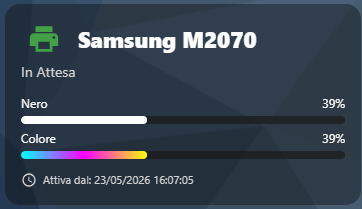

# 🖨️ DomHouse Printer Card

[](https://github.com/SalvatoreITA/DomHouse-Printer-Card/blob/main/README_it.md)
[](https://github.com/SalvatoreITA/DomHouse-Printer-Card/blob/main/README.md)

[](https://github.com/hacs/integration)
[]()
[](https://www.domhouse.it)

Una card Lovelace per Home Assistant minimale, elegante e completamente responsiva per monitorare lo stato della tua stampante e i livelli di inchiostro o toner (nero e colore).

## 📸 Screenshot

<div align="center">
  
</div>

## ✨ Caratteristiche

* **Allineamento Perfetto**: Layout della griglia ottimizzato per un perfetto allineamento ottico tra l'icona della stampante e il nome (stile button card).
* **Campanella Notifiche (NOVITÀ)**: Icona interattiva in alto a destra per monitorare e attivare/disattivare un'automazione personalizzata (es. avviso di fine inchiostro).
* **Stati Dinamici**: Icona e testi cambiano in base allo stato della stampante (*In Attesa*, *In Stampa* con animazione lampeggiante, *Non Disponibile*, ecc.).
* **Barre d'Inchiostro Grafiche**: Barre progressive per il Toner Nero ed un gradiente multicolore per il Toner a Colori (opzionale, ideale anche per stampanti monocromatiche).
* **Riquadro Uptime**: Visualizzazione pulita e formattata della data e ora di attività della stampante, con gestione intelligente delle icone senza sovrapposizioni.
* **Editor Visivo Completo**: Interfaccia di configurazione intuitiva che supporta la rimozione rapida dei sensori opzionali tramite tasto "X" (Svuota).
* **Tema Scuro Statico**: Possibilità di forzare lo sfondo scuro sfumato indipendentemente dal tema globale di Home Assistant.

## 🚀 Installazione

### Metodo 1: Tramite HACS (Consigliato)
1. Apri **HACS** nella tua istanza di Home Assistant.
2. Clicca sui tre puntini in alto a destra e seleziona **Repository personalizzati** (Custom Repositories).
3. Incolla l'URL della repository di questo progetto: `https://github.com/SalvatoreITA/DomHouse-Printer-Card/`
4. Seleziona **Lovelace** come categoria e clicca su **Aggiungi**.
5. Cerca `DomHouse Printer Card` all'interno di HACS e clicca su **Scarica**.
6. Svuota la cache del browser.

### Metodo 2: Installazione Manuale
1. Scarica il file `domhouse-printer-card.js`.
2. Caricalo all'interno della cartella `config/www/` della tua istanza di Home Assistant.
3. Vai su **Impostazioni** -> **Plance** -> **Tre puntini in alto a destra** -> **Risorse**.
4. Clicca su **Aggiungi risorsa**, inserisci `/local/domhouse-printer-card.js` e seleziona **Modulo JavaScript**.

## ⚙️ Configurazione Lovelace (YAML)

Puoi configurare la card interamente tramite l'interfaccia grafica (Visual Editor), oppure puoi usare la modalità YAML. Ecco un esempio completo di configurazione:

```yaml
type: custom:domhouse-printer-card
name: "Samsung M2070"
theme_mode: "dark" # Opzioni: default, dark
automation_entity: automation.notifica_fine_inchiostro # Opzionale
entity_printer: sensor.stampante_stato # Opzionale
entity_uptime: sensor.stampante_uptime # Opzionale
entity_black: sensor.stampante_toner_nero
entity_color: sensor.stampante_toner_colore # Opzionale (lascia vuoto se monocromatica)
```

## 🛠️ Parametri di Configurazione

| Parametro | Tipo | Obbligatorio | Descrizione |
|---|---|---|---|
| `type` | string | **Sì** | Deve essere impostato su `custom:domhouse-printer-card`. |
| `name` | string | No | Nome personalizzato della stampante (Default: `Stampante`). |
| `theme_mode` | string | No | Imposta lo stile dello sfondo. `default` segue il tema di HA, `dark` forza il tema scuro statico. |
| `automation_entity` | string | No | Entità dell'automazione legata alla stampante. Fa comparire una campanella in alto a destra cliccabile. |
| `entity_black` | string | **Sì** | Entità sensore che restituisce la percentuale del toner/inchiostro nero (0-100). |
| `entity_color` | string | No | Entità sensore per il toner/inchiostro a colori (0-100). Lascia vuoto per stampanti monocromatiche. |
| `entity_printer` | string | No | Entità sensore che traccia lo stato della stampante (`idle`, `printing`, `unavailable`, ecc.). |
| `entity_uptime` | string | No | Entità sensore che traccia la data/ora di accensione della stampante. |

## 🔔 Automazione Consigliata (Notifiche Inchiostro)

La card include una comodissima **campanella interattiva** in alto a destra. Questo tasto non è solo decorativo: ti permette di attivare o disattivare rapidamente un'automazione legata alla stampante direttamente dalla plancia, senza dover cercare nei meandri delle impostazioni!

Ecco un esempio di automazione perfetta da collegare a questo selettore. La logica è semplice ma fondamentale: il sistema monitora costantemente i livelli di inchiostro (Nero e Colori) e ti invia un messaggio di avviso non appena uno dei due scende **sotto la soglia critica del 10%**.

Puoi copiare questo blocco all'interno del tuo file `automations.yaml` (ricordati di adattare gli `entity_id` dei sensori e il `service` di notifica in base alla tua reale configurazione):

```yaml
- alias: Stampante Casa Inchiostro Push
  id: Stampante Casa Inchiostro Push
  trigger:
    - platform: numeric_state
      entity_id: sensor.canon_ts6500i_series_black
      below: 10
    - platform: numeric_state
      entity_id: sensor.canon_ts6500i_series_color
      below: 10
  condition: []
  action:
    - service: notify.mobile_app_salvatore # Sostituisci con il tuo servizio di notifica (es. notify.notify)
      data:
        title: "🖨️ Inchiostro in esaurimento!"
        message: "Il livello di {{ trigger.to_state.attributes.friendly_name }} è sceso al {{ trigger.to_state.state }}%."
  mode: single
```

## ☕ Supporta il Progetto

Ogni piccolo supporto fa un'enorme differenza: mi aiuta a mantenere vivo l'entusiasmo e mi stimola a creare e condividere nuove soluzioni per la community. Grazie di cuore per il tuo aiuto! 🚀

[](https://ko-fi.com/salvatore_dh)

## ❤️ Crediti
Sviluppato da [Salvatore Lentini - DomHouse.it](https://www.domhouse.it)
